<h3><code>stink-o@github ~ $ ./contributions.sh</code></h3>

  

<h3><code>stink-o@github ~ $ whoami</code></h3>

<table>
<tr>
<td valign="top"></td>
<td valign="top"></td>
</tr>
</table>

All art is hand-rolled animated SVG, regenerated daily by <a href=".github/workflows/update-profile-art.yml">a workflow</a> — no third-party stat services.

